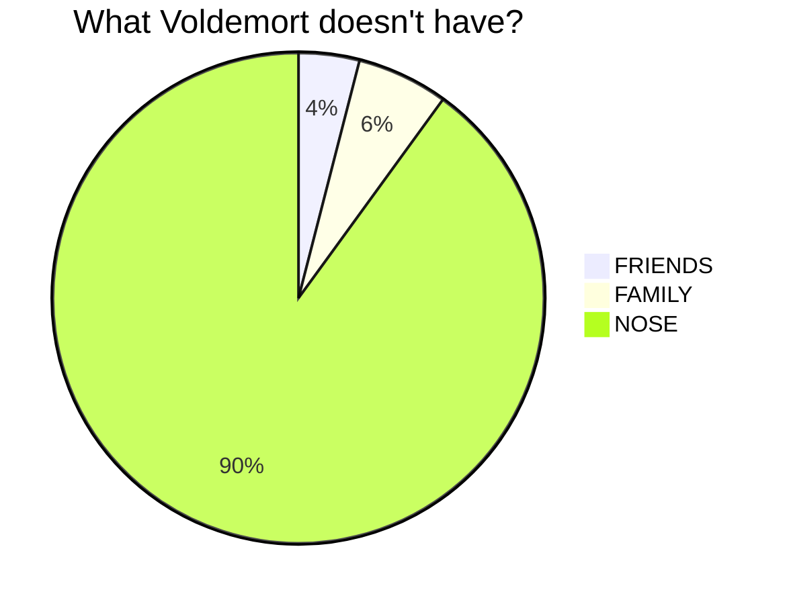
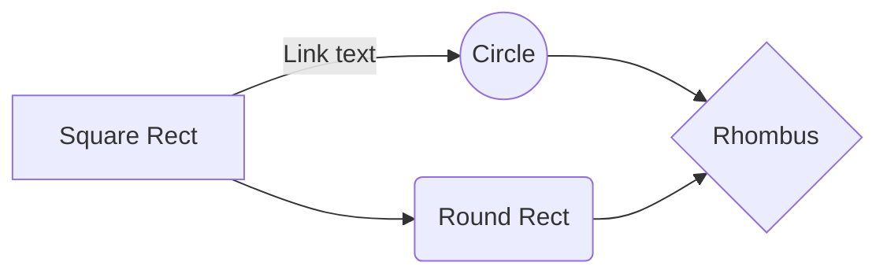
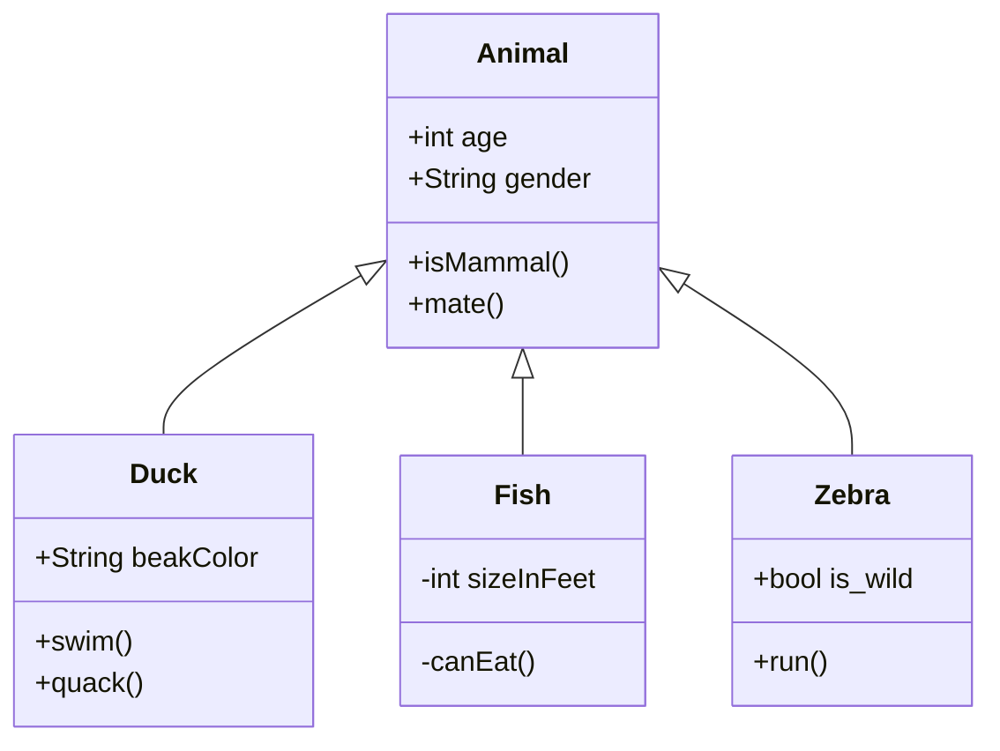

# Fortgeschrittene Formatierungen

## Icons

```
:fontawesome-regular-face-laugh-wink:
```
:fontawesome-regular-face-laugh-wink:

:smile:

## Quelltexte

````markdown title="Beispiel"
```java title="Java"
public class Foo {
	private int a = 0;

	public int add( int b ) {
		return this.a + b;
	}
}
```
````

```java title="Java"
public class Foo {
	private int a = 0;

	public int add( int b ) {
		return this.a + b;
	}
}
```

````markdown title="Beispiel"
```python title="Python"
class Foo:
	a: int = 0

	def add(self, b: int):
		return self.a + b
```
````

```python title="Python"
class Foo:
	a: int = 0

	def add(self, b: int):
		return self.a + b
```

## Math

**Tipp** können mathematische Formeln enthalten, die mit *TeX* gesetzt werden.

$$
f(x) = x^2 + 5x - 4
$$

## Diagramme







## Hinweise

Tipps können besonders hervorgehobene Hinweise enthalten:

``` title="Beispiel"
!!! erfolg

	Weit hinten, hinter den Wortbergen, fern der Länder Vokalien und 
	Konsonantien leben die Blindtexte. Abgeschieden wohnen sie in 
	Buchstabhausen an der Küste des Semantik, eines großen Sprachozeans. 
```

!!! success tipps "Erfolg"

	Weit hinten, hinter den Wortbergen, fern der Länder Vokalien und Konsonantien leben die Blindtexte. Abgeschieden wohnen sie in Buchstabhausen an der Küste des Semantik, eines großen Sprachozeans.

Wenn eine Zeile mit drei Ausrufungszeichen (`!!!`), gefolgt vom Namen einer Hinweisart, beginnt, dann werden alle folgenden Zeilen, die eingerückt sind, in einer Hinweisbox dargestellt. Mögliche Hinweisarten sind 

| Hinweisart | Alternativen         | Beispiel      |
|------------|----------------------|---------------|
| `notiz`    | `note`, `hinweis`    | `!!! notiz`   |
| `warnung`  | `warning`, `achtung` | `!!! warnung` |
| `fehler`   | `danger`, `error`    | `!!! fehler`  |
| `erfolg`   | `success`            | `!!! erfolg`  |

Jede Hinweisart wird mit einer anderen Farbe dargestellt.

!!! note tipps "Notiz"

!!! warning tipps "Warnung"

!!! danger tipps "Fehler"

!!! success tipps "Erfolg"

Um dem Hinweis einen eigenen Titel zu geben, wird dieser in Anführungszeichen hinter die Hinweisart gesetzt:

``` title="Beispiel"
!!! notiz "Lorem Ipsum"

	Weit hinten, hinter den Wortbergen, fern der Länder Vokalien und 
	Konsonantien leben die Blindtexte. Abgeschieden wohnen sie in 
	Buchstabhausen an der Küste des Semantik, eines großen Sprachozeans. 
```

!!! note tipps "Lorem Ipsum"

	Weit hinten, hinter den Wortbergen, fern der Länder Vokalien und 
	Konsonantien leben die Blindtexte. Abgeschieden wohnen sie in 
	Buchstabhausen an der Küste des Semantik, eines großen Sprachozeans. 


Steht nichts zwischen den Anführungszeichen, dann wird der Titel ganz entfernt:

``` title="Beispiel"
!!! notiz ""

	Weit hinten, hinter den Wortbergen, fern der Länder Vokalien und 
	Konsonantien leben die Blindtexte. Abgeschieden wohnen sie in 
	Buchstabhausen an der Küste des Semantik, eines großen Sprachozeans. 
```

!!! note tipps ""

	Weit hinten, hinter den Wortbergen, fern der Länder Vokalien und 
	Konsonantien leben die Blindtexte. Abgeschieden wohnen sie in 
	Buchstabhausen an der Küste des Semantik, eines großen Sprachozeans. 

## Versteckte Hinweise

Wird ein Hinweis statt mit `!!!` mit `???` (drei Fragezeichen) eingeleitet, dann wird die Box "eingeklappt" und der Inhalt zunächst versteckt. Durch einen Klick auf den Titel wird der Inhalt sichtbar gemacht.

```
??? warnung "Achtung"

	Weit hinten, hinter den Wortbergen, fern der Länder Vokalien und 
	Konsonantien leben die Blindtexte. Abgeschieden wohnen sie in 
	Buchstabhausen an der Küste des Semantik, eines großen Sprachozeans. 
```

??? warning tipps "Achtung"

	Weit hinten, hinter den Wortbergen, fern der Länder Vokalien und 
	Konsonantien leben die Blindtexte. Abgeschieden wohnen sie in 
	Buchstabhausen an der Küste des Semantik, eines großen Sprachozeans. 

Soll der Inhalt zu Beginn sichtbar sein, aber versteckt werden können, kann hinter die Fragezeichen ein Pluszeichen (`+`) gesetzt werden:

```
???+ warnung "Achtung"

	Weit hinten, hinter den Wortbergen, fern der Länder Vokalien und 
	Konsonantien leben die Blindtexte. Abgeschieden wohnen sie in 
	Buchstabhausen an der Küste des Semantik, eines großen Sprachozeans. 
```

???+ warning tipps "Achtung"

	Weit hinten, hinter den Wortbergen, fern der Länder Vokalien und 
	Konsonantien leben die Blindtexte. Abgeschieden wohnen sie in 
	Buchstabhausen an der Küste des Semantik, eines großen Sprachozeans. 
